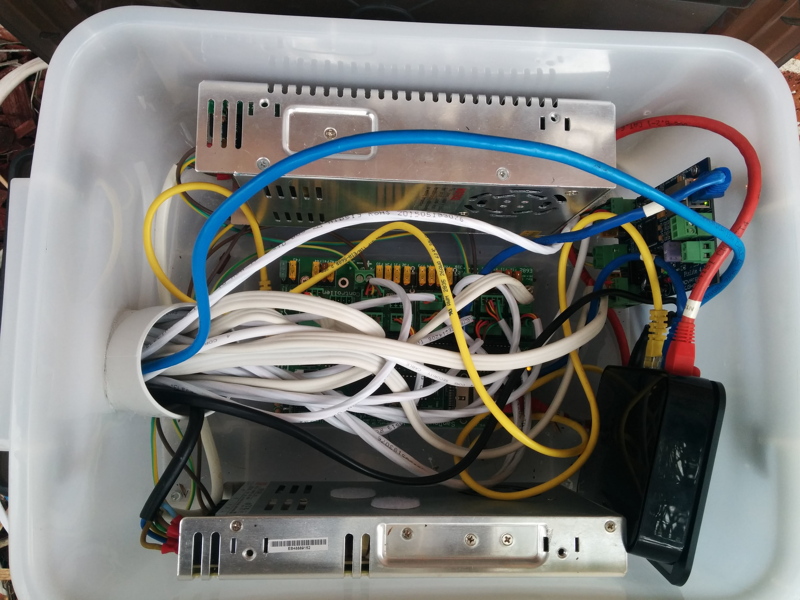

Each year I setup a display of Christmas lights in Narara.

This year (2015) I pretty much started from scratch as I moved to all pixels (each light is individually controlled)

Here are videos of my lights this year.

### Jingle Bells pon de Floor



### Light Of Christmas



### What's This



### Wizards of Winter



### Technical Details

For those that are interested this is all controlled by a Sandevices E682 and Advatek Pixlite4 sitting in a large plastic tub.

All the sequences were created in [xLights](http://www.nutcracker123.com/wk/index.php?title=Main_Page) running on Linux - and the show is controlled by [FPP](http://falconchristmas.com/wiki/Falcon_FPP) running on a Raspberry Pi

If anyone is interested in the sequences used here is a zip file containing all the sequences and my xlights\_rgbeffects.xml file

[2015\_Sequences](2015_Sequences.zip)
