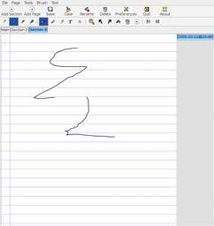

# Gournal - A Note-taking Tablet Application for Linux

[](gournal-large.png)

## Overview

Gournal is a note-taking application written for usage on Tablet-PCs (such as the [Toshiba M200](../laptop/toshiba_m200.html))
It's designed for usage with a stylus, not a mouse or keyboard.
It does _not_ have handwriting recognition but can be used in co-ordination with xstroke to accept text.
Gournal is written in perl using [gtk2-perl](http://gtk2-perl.sourceforge.net/) so you will need gtk2-perl along with the gladexml and gnomecanvas modules of gtk2-perl.
The pages are saved as gzipped SVG files (not totally standard yet but working on it)
This is my first attempt and I have never used any M$ tablet applications (deleted Win before first boot) so I don't have any idea what features are good/needed. Please email [Chris](mailto:chris@adebenham.com) with any comments/suggestions

## Details

Gournal looks/works just like a physical notebook with multiple pages.
To save memory/speed load time it only loads pages when they are viewed so the app will not run much slower if you have 1 or 100 pages.
Each page is named according to when it was created.
The pages are saved as gzipped SVG files.
Gournal has the following tools:

- Multiple sections
- Fine/Normal/Medium/Think Pens
- Eraser
- Highliter
- Typed Text
- Time-stamp
- Zoom
- Infinite undo/redo
- Delete entire strokes
- Networkable pages
- Insert Images
- Load a file as the background

## Download

Download Gournal 0.5.1 (Printing release) from here [gournal\_0.5.1-1.tar.gz](/debian/gournal_0.5.1-1.tar.gz)
Debian package: [gournal\_0.5.1-1\_all.deb](/debian/gournal_0.5.1-1_all.deb) _note: under [Debian](http://www.debian.org/) you need to have the following packages installed: libgtk2-perl, libgtk2-gladexml-perl, libgnome2-canvas-perl, libcompress-zlib-perl, libgnome2-print-perl and libxml-mini-perl_. Use equivalent packages for other distros
A Debian package is available from my repository. Add ```deb http://staging.adebenham.com/debian/ ./``` to your sources.list and then install ```gournal```

## Credits

Gournal was written by Chris Debenham [<chris@adebenham.com>](mailto:chris@adebenham.com)
It was inspired by [Jarnal](http://www.dklevine.com/general/software/tc1000/jarnal.htm) which is a journal application written in Java by David K. Levine
Gournal would not be possible without the hard work of the [gtk2-perl](http://gtk2-perl.sourceforge.net/) hackers
