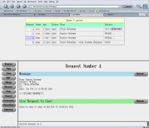

[](large.jpg)

**Current Version: _0.14_**
Reqtool is a pure perl application that both handles email requests and provides a web interface to track, edit and resolve these email requests. It requires no external DB or additional apps other than a web server.

It includes a command line interface which processes incoming emails and a web front-end for dealing with the tickets.
**New Feature! Now handles Japanese Characters (and maybe other character sets, but not tested. See image for example**

## Features

- Handles Japanese characters
- Handles Authentication with LDAP or passwd file
- Single instance for multiple queues
- Takes in all common message types (mime, multipart etc)
- Can send email attachments as well as read them
- Can merge requests
- Can drop requests that aren't needed
- Web interface to administer
- Can generate statistics for arbitrary dates/periods
- Multiple seperate queues from one instance

## Downloads

Click [here](http://prdownloads.sourceforge.net/reqtool/reqtool-0.14.tar.gz) to download version 0.14 of Reqtool

## Documentation

Documentation is available as html or PDF format for printing
The PDF file contains all the available documentation including installation, developer documentation and full documentation of every function, method and structure
The HTML version only contains a reference to the functions, methods and structures but is hyperlinked
Neither are included in the tar-ball so if you want them, download them from below
[HTML Documentation](/files/reqtool/docs/index.html) [PDF Documentation](/files/reqtool/docs/reqtool.pdf)

Reqtool was written by Chris Debenham [(mail me)](mailto:chris@adebenham.com) and was originally based on the great work by the authors of Reqng which was inturn based on req but contains no code from those original programs in the end.

## Installation

For installation of Reqtool follow these 7 easy steps.

**1.** Make sure you have a web server and perl installed
Reqtool is written in perl and is accessed via a web server so you will require perl/apache (or similar) to be installed.
To download these go to [http://www.perl.com](http://www.perl.com/) and [http://www.apache.org](http://www.apache.org/) or just install them from your distributions install disks.
LDS also requires a few perl modules such as CGI and MIME-tools. These may already be installed or you can install them from [CPAN](http://www.cpan.org/) or your install disks.

**2.** Download the main Reqtool program
LDS is available at [http://prdownloads.sourceforge.net/reqtool/reqtool-0.14.tar.gz](http://prdownloads.sourceforge.net/reqtool/reqtool-0.14.tar.gz) **3.** Extract the files
To untar the main program run _tar xvfz reqtool-0.14.tar.gz_ **4.** Run the _install_ script
The install script checks for the existance of certain perl modules, asks a few questions then installs the app

**5.** Edit reqtool for your site
Open up default/config in the editor of your choice
Edit this section as required

**6.** Setup email parsing
Next you need all mail going to the mailing-list to pass through reqtool
A good way of doing this is to add a line to your /etc/mail/aliases (or similar) that looks like the following line (changing paths/addresses as needed)
_reqtool-test: \|"/usr/local/reqtool/reqtool default -"_
But to do this your webserver needs to be running as the same user as sendmail
If you don't wish to do it this way, just add a user to your machine, subscribe it to the list etc and add a .forward file for that user which pipes the mail through /usr/local/reqtool/reqtool default -

**7.** Done
If all has gone well you should be able to send email to the mailing-list/email address and it will come up in the web interface which can be accessed as ``` http://hostname/cgi-bin/reqtool ```

## Thanks

Thanks go to Remy Evard and other members of the systems group at [Northeastern University's College of Computer Science](http://www.ccs.neu.edu) for thier work on the original req.

Thanks also go to the authors of [ReqNG](http://reqng.sycore.net/reqng) and [WWWREQ](http://www.cs.ucr.edu/~cvarner/wwwreq/) which the interface is based on.

## Project details

If you wish to you can join the reqtool-devel mailing list (which is for developers) at [reqtool-devel](http://lists.sourceforge.net/lists/listinfo/reqtool-devel) or the reqtool-users mailing list (which is for reqtool users :-) at [reqtool-users](http://lists.sourceforge.net/lists/listinfo/reqtool-users)
To view the CVS go to [http://cvs.sourceforge.net/cgi-bin/viewcvs.cgi/reqtool](http://cvs.sourceforge.net/cgi-bin/viewcvs.cgi/reqtool)
